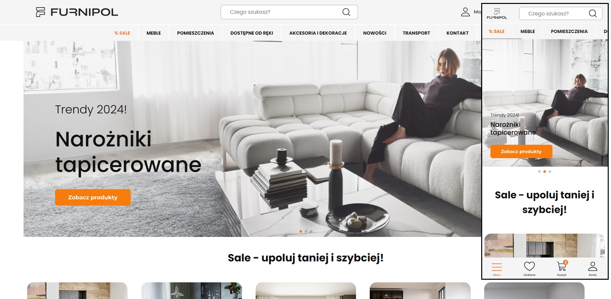
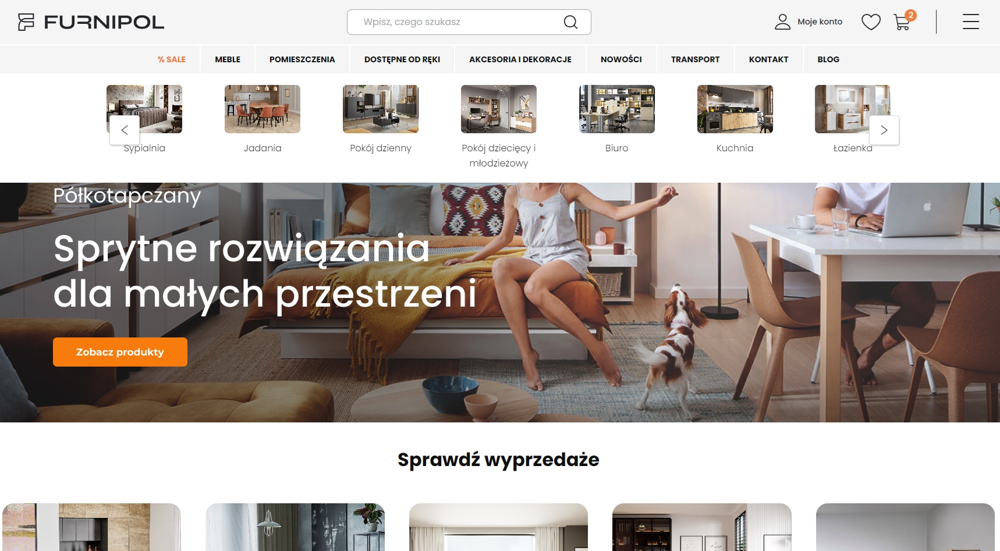
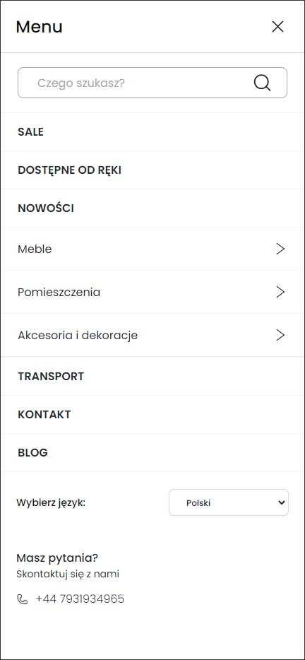
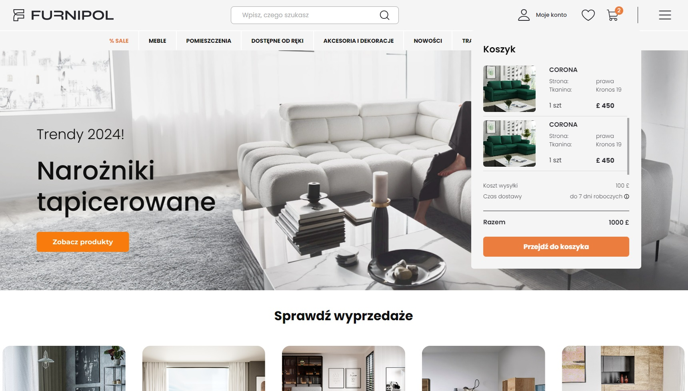

<p align="center">
    
</p>

<h1 align="center">FURNIPOL website</h1>

<p align="center">Furnipol ➡️ E-commerce website connected with furniture industry.</p>

## Table of contents

- [Description](#description)
- [Features](#features)
- [Technologies](#technologies)
- [Installation](#installation)
- [License](#license)
- [Live](#live)
- [Screenshots](#screenshots)

## Description

This project is a responsive e-commerce website for Furnipol, a furniture company. It showcases various furniture collections, categories, and promotions with a modern design optimized for both desktop and mobile devices.

## Features

- **Responsive Design**: Optimized for desktop, tablet, and mobile devices
- **Hero Slider**: Dynamic image carousel on the homepage
- **Product Categories**: Browse furniture by rooms and categories
- **Collection Tabs**: Explore different furniture collections
- **Favourite Categories**: Highlighted popular product categories
- **Sale Section**: Promotional offers and discounts
- **Newsletter Signup**: Email subscription for updates
- **Customer Reviews**: Trustpilot integration for reviews
- **Cart Preview**: Quick view of shopping cart items
- **Mobile Menu**: Touch-friendly navigation for mobile users
- **Tapbar**: Additional navigation bar for mobile

## Technologies

Used technologies:

- JavaScript
- jQuery 1.12.2
- Swiper.js 11.1.4
- Bootstrap 3.3.7
- HTML5
- SCSS

## Installation

1. Clone the repository:

   ```bash
   git clone https://github.com/goldipl/furnipol-furnitures.git
   ```

2. Navigate to the project directory:

   ```bash
   cd furnipol-furnitures
   ```

3. Open `index.html` in your web browser to view the website.

**Note**: The styles are written in SCSS. To modify styles, edit the files in the `sass/` directory and compile them to CSS. The compiled CSS files are already included in the `css/` directory.

## License

License Creative Commons Non-Commercial (CC BY-NC) License 

This work is licensed under a Creative Commons Non-Commercial (CC BY-NC) License (not for commercial use)

## Live

https://goldipl.github.io/furnipol-furnitures/

## Screenshots

`Desktop & mobile version` :desktop_computer: :iphone:

- Main Page



- Hover Desktop Nav Menu



- Expanded Mobile Menu



- Cart preview


