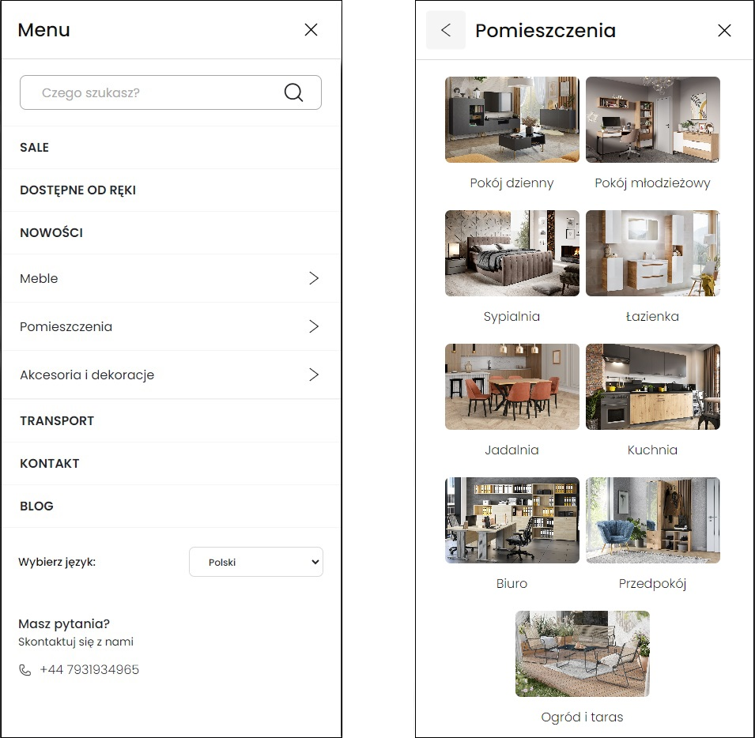

    

<h1 align="center">FURNIPOL website</h1>

Furnipol ➡️ E-commerce website connected with furniture industry.

## Table of contents

- [Technologies](#technologies)
- [License](#license)
- [Live](#live)
- [Screenshots](#screenshots)

## Technologies

Used technologies:

- JavaScript
- jQuery 1.12.2
- Swiper.js 11.1.4
- Bootstrap 3.3.7
- HTML5
- SCSS

## License

License Creative Commons Non-Commercial (CC BY-NC) License 

This work is licensed under a Creative Commons Non-Commercial (CC BY-NC) License (not for commercial use)

## Live

https://goldipl.github.io/furnipol-furnitures/

## Screenshots

`Desktop & mobile version` :desktop_computer: :iphone:

- Main Page

- Expanded Desktop Menu

- Expanded Mobile Menu

- Cart preview

